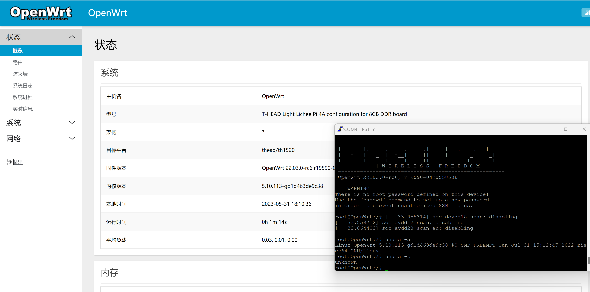

（这张图太老了，板子给 hxd 玩了，有没有帅气/可爱的好心人帮忙补一下新的截图）

## Getting started

## 使用

### 下载预构建镜像

[Releases](https://github.com/chainsx/openwrt-th1520/releases)

### 刷写系统

参考 [这里](https://github.com/chainsx/armbian-riscv-build/blob/main/doc/licheepi-4a-install-guide.md).

注意：其中所使用到的 u-boot 以及系统镜像需要替换为本仓库的

## 如何使用 WiFi

```
wifi config
reboot
```

### 默认信息

管理 IP: `192.168.1.1`

用户: `root`

密码: 无

### 内置软件包

嘿嘿，不告诉你，，，

## 自行编译

### 准备环境

编译主机：Ubuntu 22.04, Debian 12 (理论上不限架构)

**不能使用 root 用户进行编译！**

### 1.  使用一次构建脚本

```
bash build_all.sh
```

### 2.  按步骤编译（自定义配置）

<details>
<summary>&#160&#160&#160 展开</summary>

#### 安装依赖

```
sudo apt update

sudo apt install -y ack binutils bison build-essential \
	ccache cmake device-tree-compiler flex gawk gettext \
	git gperf intltool libelf-dev libglib2.0-dev \
	libgmp3-dev libltdl-dev libncurses5-dev libssl-dev \
	libreadline-dev libtool wget nano patch sudo \
	pkgconf python3 python3-pyelftools xxd zlib1g-dev \
	subversion swig texinfo unzip rsync
```

#### 下载代码

```
git clone https://github.com/chainsx/openwrt-th1520 --depth=1
```

#### 更新 feeds

```
cd openwrt-th1520/riscv-openwrt
./scripts/feeds update -a
./scripts/feeds install -a
cd ..
```

#### 应用配置文件

```
cp lpi4a.config riscv-openwrt/.config
cd riscv-openwrt && make defconfig
```

#### 自定义配置

```
make menuconfig
```

#### 开始编译

```
make download V=s -j$(nproc) && make V=s -j$(nproc)
```
</details>

## Thanks

[Rabenda aka revy](https://github.com/Rabenda)

[saeziae](https://github.com/saeziae)
